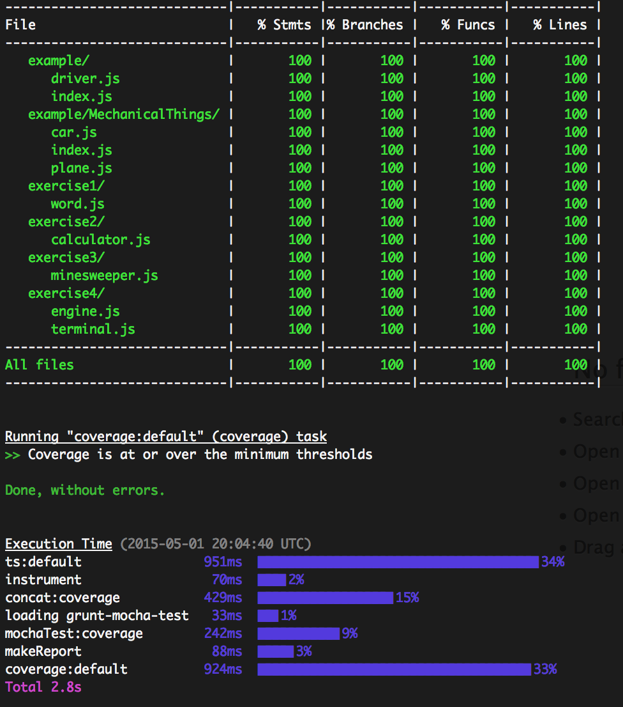

# Overview

This project contains a set of exercises to help teach TDD. It will auto-compile your TypeScript code, run your tests 
and, enforce a
minimum code coverage percentage (95%).

# Installing and running

You'll need to install [npm](https://docs.npmjs.com/getting-started/installing-node) and change your current working directory to this folder.

Install all dependencies:

```shell
$ npm install
```

DO NOT use `sudo` in this step or you will have problems!

## Setting up TypeScript watchers (compiles your code)

For these exercises, we will use [Grunt](http://gruntjs.com/) to manage the build process.

Test that `npm watch` is working correctly:

```shell
$ npm run watch
```

You should see it "waiting..." If so, CTRL + C to break out and then run the tests manually:

```shell
$ npm test
```

If you see the following, your setup process is complete:



To get notifications working, you may need to install the following:

1. Install [Growl](http://growl.info/downloads#growlnotify)
2. Run `sudo gem install terminal-notifier`

## Seeing Code Coverage

You can see code coverage analysis in two ways:

1. Make a change while `grunt watch` is on and read the console
2. Run `grunt test` and read the console

Then visit [the lcov report page](./coverage/reports/lcov-report/index.html) (file will be missing if a coverage 
analysis has not been run)

# Under the Hood

You can find all of the grunt configurations in the `grunt` folder. Here's what Grunt is doing:

1. Compiled TypeScript output (JavaScript) goes to the [`out`](./out) folder while preserving the original file/folder 
structure.
2. All of the `.js` files are then copied (concatenated) to [`out/test.js`](./out/test.js) and 
[`out/coverage.js`](./out/coverage.js) file. The source maps are preserved.
3. All `out/src/**/*.js` files are "instrumented" by Istanbul for code coverage analysis. The results are stored in 
[`out/instrument`](./out/instrument).
4. Code coverage involves running all tests against this instrumented folder. The instrumented files are merged with 
test files and placed in [`out/coverage.js`](./out/coverage.js). The file is executed.
5. Coverage results are captured in [`coverage/`](./coverage/).
6. Coverage thresholds are configured in [`grunt/coverage.js`](./grunt/coverage.js) and the data is pulled from 
[`coverage/reports/coverage.json`](./coverage/reports/coverage.json).
7. If any grunt process fails (e.g., a test or a coverage threshold) an error is shown and the rest of the jobs stop.
8. `npm run watch` watches for code changes that trigger the above steps automatically as necessary. It is meant to be 
noisy if you are not writing passing tests.

# Exercises

1. [Exercise 1](./src/exercise1/README.md)
2. [Exercise 2](./src/exercise2/README.md)
3. [Exercise 3](./src/exercise3/README.md)
4. [Exercise 4](./src/exercise4/README.md)

Review the [example project](./src/example/README.md) if you have questions about TypeScript.

# Notes

## TypeScript

* Pay special attention to nesting modules: top level modules don't use `export`, but children should. See more here: 
[http://stackoverflow.com/questions/12991382/typescript-modules](http://stackoverflow.com/questions/12991382/typescript-modules)
* TypeScript files should always start with a reference line (think of it as a header file) that links to 
[references.ts](./references.ts) using a relative path; for example:

```typescript
/// <reference path="../../references.ts" />
```

## Structure

* Executed JS is not kept as separate files. This is to avoid the complexity of using Node's `require` syntax in a 
TypeScript environment (although entirely doable).
* You can find example files at [`src/example/`](./src/example/) and [`test/example/`](./test/example/).
* You can find instructions for individual exercises in the [`src/`](./src/) folder.
* TypeScript declarations are found in [`tsd.d.ts`](./tsd.d.ts), and are managed using `tsd`. They are like `.h` files 
in other languages. If you end up using external libraries such as Underscore.js, you may want to install dependencies
using `tsd install [name] --save` (more on this here: 
[https://github.com/DefinitelyTyped/tsd](https://github.com/DefinitelyTyped/tsd))
* Folders you may want to mark as excluded from your IDE's code index: `out/`, `node_modules/`, and `coverage/`.

## Resources

* This setup process borrows from the [Typescript Starter repo](https://github.com/michikono/typescript-starter)
* You need to install `npm` (`node` [comes with it](http://nodejs.org/download/)). This is because TypeScript
compiles to JavaScript and without Node, you would need to run your code in a browser. Running sample snippets in a 
browser adds unnecessary complexity as compared to running Node scripts.
* Testing is done using two libraries. One is [Mocha](http://mochajs.org/#getting-started), a framework for writing 
assertions (the `assert` variable). The other is [Sinon](http://sinonjs.org/docs/), a stubbing and mocking library 
(the `sinon` and `sandbox` variables). See examples of this in [Driver tests](./test/example/driver.ts).
* As a convenience, all test modules have a `sandbox` variable that you can use to make stubs. It will clean up your 
mocks and stubs after each test run. You can mostly ignore this, but if you are curious why this was setup, you can 
find more about it [here](http://sinonjs.org/docs/#sandbox).
